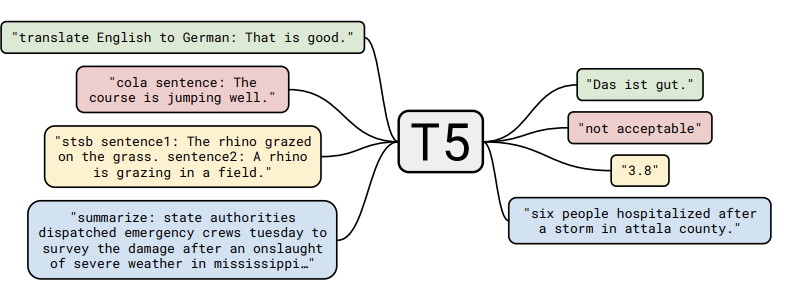

## Introduction
Topic sentence is one of the crucial parts for readers in article reading for many reasons. It summarizes the main idea of a body paragraph to show the big picture of a writer's idea to readers. Other than being a mere summary, topic sentence also serves as a sub-thesis of an article which is general enough to cover the support in the rest of body paragraph while being more direct than the thesis of the whole article[1]. Hence, finding a way to summarize the paragraph with a grammatical sentence will be very helpful for readers to recognize the main idea much easier in a short period of time.

Our goal is to build a topic sentence generation tool. This tool receives a body paragraph as the input then returns a summary sentence as the output. During the project development, we have learned and implemented multiple machine learning algorithms as well as various of libraries and cloud services in order to reach the higher accuracies of topic sentence extraction comparing to the references. 

## Methodologies

### Dataset Sample
The dataset we use is [arXiv Dataset](https://www.kaggle.com/Cornell-University/arxiv) from Kaggle which includes millions of paper metadata in json format. This dataset contains millions of public scholarly article metadata in json format. Each metadata contains an article id, authors, title, abstract and so on. The topic sentence extraction algorithm will extract one topic sentence from each abstract of article and compare them with the title of that one.
```javascript
{
  "id": "0704.0001",
  "submitter": "Pavel Nadolsky",
  "authors": "C. Bal\\'azs, E. L. Berger, P. M. Nadolsky, C.-P. Yuan",
  "title": "Calculation of prompt diphoton production cross sections at Tevatron and\n  LHC energies",
  "comments": "37 pages, 15 figures; published version",
  "journal-ref": "Phys.Rev.D76:013009,2007",
  "doi": "10.1103/PhysRevD.76.013009",
  "report-no": "ANL-HEP-PR-07-12",
  "categories": "hep-ph",
  "license": null,
  "abstract": "  A fully differential calculation in perturbative quantum chromodynamics is\npresented for the production of massive photon pairs at hadron colliders. All\nnext-to-leading order perturbative contributions from quark-antiquark,\ngluon-(anti)quark, and gluon-gluon subprocesses are included, as well as\nall-orders resummation of initial-state gluon radiation valid at\nnext-to-next-to-leading logarithmic accuracy. The region of phase space is\nspecified in which the calculation is most reliable. Good agreement is\ndemonstrated with data from the Fermilab Tevatron, and predictions are made for\nmore detailed tests with CDF and DO data. Predictions are shown for\ndistributions of diphoton pairs produced at the energy of the Large Hadron\nCollider (LHC). Distributions of the diphoton pairs from the decay of a Higgs\nboson are contrasted with those produced from QCD processes at the LHC, showing\nthat enhanced sensitivity to the signal can be obtained with judicious\nselection of events.\n",
  "versions": [...],
  "update_date": "2008-11-26",
  "authors_parsed": [...]
}
```

### Preliminary Attempts

#### RAKE with NLG
The very first idea of our team is using RAKE(Rapid Automatic Keyword Extraction) to extract the keywords from abstracts with Natural Language Generation, neural network like RNN and Transformer for example, to generate a readable sentence. However, the final performance was diappointed because of the trivialness of the extracted keywords comparing with the abstracts and the unrelatedness between keywords.

#### AWS Comprehend
Our team had also tried to take advantage of AWS Comprehend for keyword extraction. But the results are not meet our expectation since the extracted keywords and phrases are too much to generate a meaningful sentence. Also we found that the dataset we were going to use did not provide ground truth to be used during keyword extraction. So we had to use unsupervised learning methods which is less reliable than supervised ones.

### Final Desicion
After serveral unsuccessful attempts mentioned aboved, our team finally considered to switch the initial idea of combining keyword extraction with topic sentence generation to topic sentence extraction.

#### T5 Model
T5(Text-to-Text Transfer Transformer) is an encoder-decoder model pre-trained on a multi-task mixture of unsupervised and supervised tasks and for which each task is converted into a text-to-text format. The text-to-text framework allows researchers to apply the same model to various generative NLP tasks such as question answering, document summerization, sentiment classfication, and so on.[2]<br/>
<div align=center>
    
</div>

This model mainly comprises an encoding part and a decoding part. The encoder’s inputs first flow through a self-attention layer – a layer that helps the encoder look at other words in the input sentence as it encodes a specific word. The outputs of the self-attention layer are fed to a feed-forward neural network. The exact same feed-forward network is independently applied to each position.The decoder has both those layers, but between them is an attention layer that helps the decoder focus on relevant parts of the input sentence.[3]
<div align=center>
    
</div>

#### BLEU 
BLEU(bilingual evaluation understudy) is an algorithm for evaluating the quality of translation by using machine from one language to another.[4] It can also be used to compare the similarity between two sentences. That is, the algorithm compute the n-gram overlap between the candidate sentence and multiple reference sentences from corpus with brevity penalty which is used for lowering the score properly when the candidate sentence is too short compared to the closest reference.[5] By using the BLEU, we can evaluate the accuracy of the extracted topic sentences by comparing them to actural titles.

## References
1. [Wikipedia: Topic Sentence](https://en.wikipedia.org/wiki/Topic_sentence)
2. [Exploring the Limits of Transfer Learning with a Unified
Text-to-Text Transformer](https://arxiv.org/pdf/1910.10683.pdf)
3. [The Illustrated Transformer](http://jalammar.github.io/illustrated-transformer/)
4. [Wikipedia: BLEU](https://en.wikipedia.org/wiki/BLEU)
5. [Evaluating models](https://cloud.google.com/translate/automl/docs/evaluate#bleu)